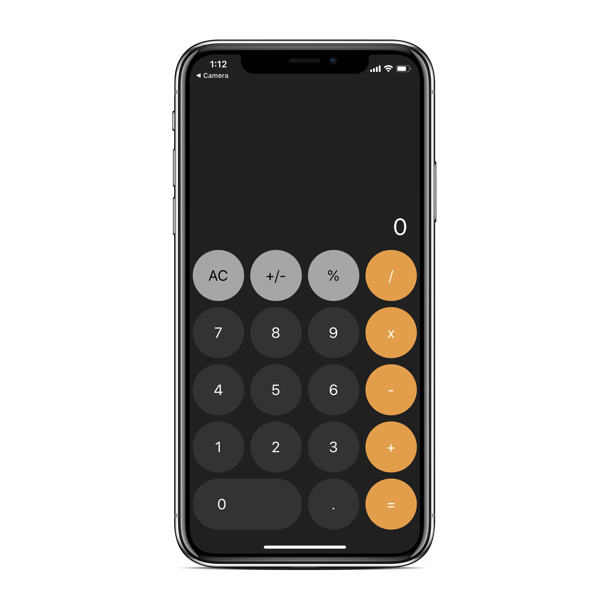
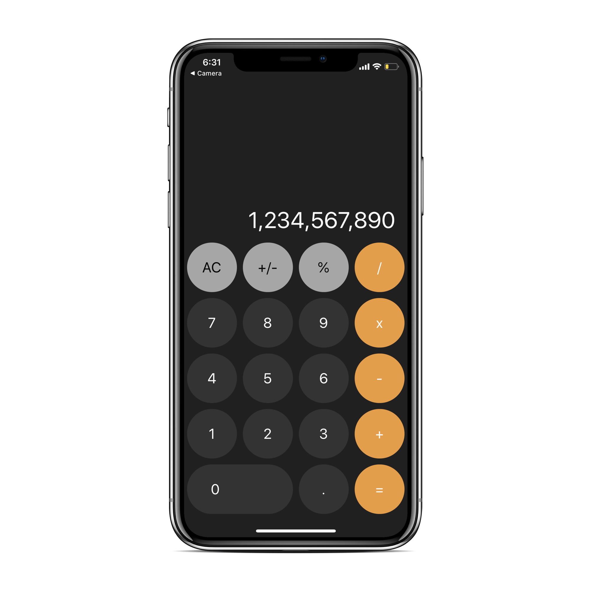

## React Native Calculator App

A simple cross platform (iOS and Android) React Native timer app.

|            Image-1            |            Image-2            |
| :---------------------------: | :---------------------------: |
|  |  |

### Installation

- `git clone https://github.com/Manojj999/RN-Calculator.git`
- `yarn install`/`npm install`

### Running

---

## Emulator:

- `yarn run ios`/`npm run ios` or `yarn run android`/`npm run android`

## Actual Device

- Install Expo Client on Android or IOS then
- `yarn start`/`npm start`
- Scan Qr code
